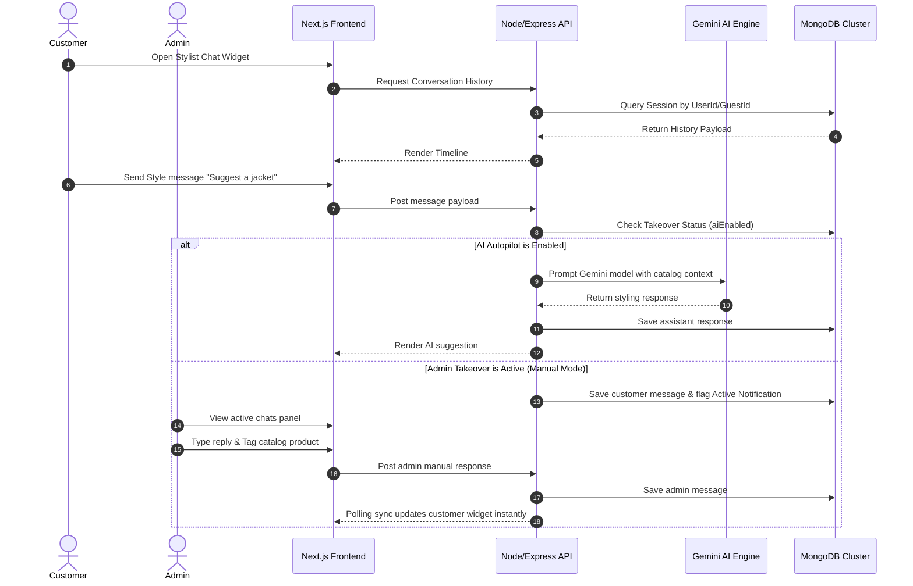

# VESTRA | Premium Modern Minimalist Fashion Store

[](https://vestra-fashion.vercel.app/)
[](https://nextjs.org/)
[](https://tailwindcss.com/)

**VESTRA** is a premium, state-of-the-art e-commerce storefront presenting clean lines, modern typography, and curated minimalist wardrobe essentials for Men, Women, and Kids.

Live Demo: [https://vestra-fashion.vercel.app/](https://vestra-fashion.vercel.app/)

---

## ⚡ Tech Stack & Architecture

- **Framework:** Next.js (App Router) using Turbopack for high-performance builds.
- **Styling:** Vanilla CSS & Tailwind CSS featuring custom minimalist design tokens (such as `primary` VESTRA Lime `#C9FA75` and bold `#111111` accents).
- **Notifications:** React Hot Toast styled with custom dark pill badges and lime green success checks.
- **Icons:** Gravity UI Icons paired with custom high-fidelity SVG paths.
- **State Management:** Decentralized, event-driven client state synced with `localStorage` (incredibly lightweight, zero-dependency, and junior-developer friendly).

---

## 🌟 Key Features

### 1. Dynamic Landing Page
- **Hero Banner:** Bold header with custom brand trust statements and clean calls-to-action utilizing Gravity UI icons.
- **Shop By Category:** Staggered category grids with responsive border outlines matching selected circles.
- **The Vestra Difference:** Embedded value propositions directly integrated into the brand manifesto with high-contrast truck and return icons.
- **Discover Mosaic:** Responsive staggered 2x2 grid image layout flanking custom CTA collection links.
- **Customer Reviews:** Responsive horizontal swipeable review row displaying customer avatars and star ratings.

### 2. Shop Page (`/products`)
- **Category Filter Tabs:** Simple interactive tabs pre-selected dynamically on URL click.
- **Dynamic Price Range:** Calculated dynamically from the maximum product price found in the database.
- **Case-Insensitive Search:** Real-time filter matching search input directly with product titles.

### 3. Product Details Page (`/products/[id]`)
- **Dynamic Retrieval:** Matches route parameters to display details dynamically from the database.
- **Interactive Gallery:** Lets users click thumbnails to cycle product images.
- **Select Options:** Dynamic states for sizes and colors.
- **Item Count Counters:** Simple `+/-` increment triggers.
- **Fallback Card:** Renders an inline *"Product Not Available"* warning if the ID is invalid instead of crashing.

### 4. Slide-over Cart Drawer
- **Responsive Drawer:** Slides out from the right with a clean dark backdrop overlay.
- **Event-Driven Auto-Open:** Automatically opens the drawer whenever an item is added to the cart from the details page.
- **Real-Time Counters:** Syncs item count badges instantly inside the main navigation bar.

### 5. Static & Auth Pages
- **Authentication:** Dedicated `/login` and `/register` pages featuring interactive input controls and form validation.
- **Corporate Info:** Dedicated `/about` and `/contact` sheets containing statistics cards and contact form logs.

---

---

## ⚙️ Core Workflows & System Architecture

This project operates as a hybrid intelligent e-commerce ecosystem. Below are the functional workflows explaining how the client frontend communicates with the server backend and database layers:



---

### 💬 Vestra Stylist Chatbot & Admin Takeover Console

#### Customer Styling Widget
- **Autopilot Interaction**: By default, the floating chat widget ([ChatWidget.tsx](file:///Users/zabedmahmud/Documents/Projects/Vestra-Fashion/Vestra-Fasion-Client/src/components/ai/ChatWidget.tsx)) matches the customer with the **Vestra Stylist** AI agent. It answers queries regarding outfit styling, size fits, and catalog match suggestions.
- **Persistent Sessions**: Chat histories are stored persistently in MongoDB mapped to the customer's unique `userId` (or in guest `localStorage` if not signed in). Chat streams are preserved across tab reloads and screen transitions.
- **Responsive Sizing**: The widget renders fullscreen (`fixed inset-0`) on mobile screens, shifting to a floating rounded popover (`w-[400px] h-[550px]`) on desktop screen dimensions.
- **Snap Polling**: Runs history synchronization immediately on widget launch, and background polls the server every **2.5 seconds** to display admin manual replies instantly.

#### Administrator Takeover Dashboard
- **Autopilot Toggle**: In the stylist dashboard panel ([chats/page.tsx](file:///Users/zabedmahmud/Documents/Projects/Vestra-Fashion/Vestra-Fasion-Client/src/app/dashboard/chats/page.tsx)), administrators monitor chat threads in real-time. They can click the mode button (labeled with a **Robot** icon `FaceRobot` for Autopilot, and a **Human** icon `Person` for Manual Mode) to suspend the AI and take manual control.
- **Product Mention Tool**: When drafting manual replies, administrators can open a searchable **Mention Product** selector popup. Clicking catalog search results automatically inserts formatted recommendation markdown links (e.g. `[Product Name](/products/PRODUCT_ID)`) into the text box, which parse into stylized hyperlinks inside the client's chat widget.

---

### 🏷️ AI-Powered Descriptive Tagging (Gemini Vision)

- **Vision Cataloging**: In the product inventory dashboard ([products/page.tsx](file:///Users/zabedmahmud/Documents/Projects/Vestra-Fashion/Vestra-Fasion-Client/src/app/dashboard/products/page.tsx)), admins can upload product images and click the **Generate Tags** action.
- **Image Parsing**: The backend relays the image buffer to Gemini Vision. The model processes visual attributes (such as color tones, patterns, necklines, and fabrics) and responds with relevant styling tags.
- **Fail-Safe Mechanism**: The AI engine is wrapped in try-catch overrides to capture 429 rate limit exceptions, warning the user: *"AI limit reached. Please wait 6 seconds and try again."* instead of triggering frontend runtime error overlays.

---

### 🛡️ Customer Dispute Tracking & Platform Messaging

- **Filing Claims**: Authenticated customers can view their invoices under `/orders` and click the **Report Issue** control. They fill out a dispute form, upload image evidence, and submit it.
- **Dispute Logging**: The claim is written to the database `contacts` collection.
- **Real-Time Notification Badges**: The administrator dashboard sidebar layout background-polls statistics. When new orders, reviews, or dispute claims arrive, count badges beside sidebar link headers update instantly to prompt moderation.

---

### 👤 Customer Profile Settings & Autofill Controls

- **Settings Page**: Logged-in customers edit their Name, Email, and Mobile number from the `/profile` settings page. Form submission updates their profile in the MongoDB `users` collection and triggers a context refresh to update layout greeting labels immediately.
- **Autofilled Forms**: The Contact Us form under `/contact` accesses user sessions to pre-fill identity inputs, allowing clients to submit queries with a single click.

---

## 📂 Project Directory Structure (Line-by-Line Guide)

### 🖥️ Next.js Application Pages (`src/app/`)
* **[layout.tsx](file:///Users/zabedmahmud/Documents/Projects/Vestra-Fashion/Vestra-Fasion-Client/src/app/layout.tsx)**: Root application wrapper. Configures the React Query client, Authentication context provider, global fonts, and mounts global layout elements: [Navbar](file:///Users/zabedmahmud/Documents/Projects/Vestra-Fashion/Vestra-Fasion-Client/src/components/layout/Navbar.tsx), [CartDrawer](file:///Users/zabedmahmud/Documents/Projects/Vestra-Fashion/Vestra-Fasion-Client/src/components/layout/CartDrawer.tsx), [WishlistDrawer](file:///Users/zabedmahmud/Documents/Projects/Vestra-Fashion/Vestra-Fasion-Client/src/components/layout/WishlistDrawer.tsx), and [ChatWidget](file:///Users/zabedmahmud/Documents/Projects/Vestra-Fashion/Vestra-Fasion-Client/src/components/ai/ChatWidget.tsx).
* **[page.tsx](file:///Users/zabedmahmud/Documents/Projects/Vestra-Fashion/Vestra-Fasion-Client/src/app/page.tsx)**: Front store landing page. Renders the main Hero banner, featured catalog lists, brand trust statements, and customer testimonials.
* **[products/page.tsx](file:///Users/zabedmahmud/Documents/Projects/Vestra-Fashion/Vestra-Fasion-Client/src/app/products/page.tsx)**: Main shopping catalog search page. Features category tabs, price range filters, search inputs, and pagination controls.
* **[products/[id]/page.tsx](file:///Users/zabedmahmud/Documents/Projects/Vestra-Fashion/Vestra-Fasion-Client/src/app/products/%5Bid%5D/page.tsx)**: Dynamic product details page. Implements selector options for sizes, color pickers, reviews timeline, and DB-synchronized wishlist toggle buttons.
* **[profile/page.tsx](file:///Users/zabedmahmud/Documents/Projects/Vestra-Fashion/Vestra-Fasion-Client/src/app/profile/page.tsx)**: Customer profile dashboard. Allows authenticated clients to view and modify their Name, Email, and Mobile number.
* **[orders/page.tsx](file:///Users/zabedmahmud/Documents/Projects/Vestra-Fashion/Vestra-Fasion-Client/src/app/orders/page.tsx)**: Customer orders tracking board, displaying all purchase receipts and checkout timeline status.
* **[reports/page.tsx](file:///Users/zabedmahmud/Documents/Projects/Vestra-Fashion/Vestra-Fasion-Client/src/app/reports/page.tsx)**: Customer contact log tracker, matching authenticated user profile records.
* **[contact/page.tsx](file:///Users/zabedmahmud/Documents/Projects/Vestra-Fashion/Vestra-Fasion-Client/src/app/contact/page.tsx)**: Contact Us form. Pre-fills customer identity fields automatically using active sessions.
* **[about/page.tsx](file:///Users/zabedmahmud/Documents/Projects/Vestra-Fashion/Vestra-Fasion-Client/src/app/about/page.tsx)**: Minimalist brand story details, mission manifesto, and corporate figures.
* **[login/page.tsx](file:///Users/zabedmahmud/Documents/Projects/Vestra-Fashion/Vestra-Fasion-Client/src/app/login/page.tsx)** & **[register/page.tsx](file:///Users/zabedmahmud/Documents/Projects/Vestra-Fashion/Vestra-Fasion-Client/src/app/register/page.tsx)**: Client authorization forms.

### 🛡️ Admin Dashboard Console (`src/app/dashboard/`)
* **[layout.tsx](file:///Users/zabedmahmud/Documents/Projects/Vestra-Fashion/Vestra-Fasion-Client/src/app/dashboard/layout.tsx)**: Admin dashboard sidebar navigation and headers. Implements responsive sidebar touch-out auto-closing behavior.
* **[page.tsx](file:///Users/zabedmahmud/Documents/Projects/Vestra-Fashion/Vestra-Fasion-Client/src/app/dashboard/page.tsx)**: Admin overview KPI dashboard, graphing revenue, orders, and sales distribution.
* **[products/page.tsx](file:///Users/zabedmahmud/Documents/Projects/Vestra-Fashion/Vestra-Fasion-Client/src/app/dashboard/products/page.tsx)**: Product catalog inventory manager (adding, editing, deleting items with AI descriptive tag generator).
* **[orders/page.tsx](file:///Users/zabedmahmud/Documents/Projects/Vestra-Fashion/Vestra-Fasion-Client/src/app/dashboard/orders/page.tsx)**: Platform order tracker. Allows administrators to update checkout states to 'Delivered' or cancel shipments.
* **[reviews/page.tsx](file:///Users/zabedmahmud/Documents/Projects/Vestra-Fashion/Vestra-Fasion-Client/src/app/dashboard/reviews/page.tsx)**: Customer reviews feedback board.
* **[reports/page.tsx](file:///Users/zabedmahmud/Documents/Projects/Vestra-Fashion/Vestra-Fasion-Client/src/app/dashboard/reports/page.tsx)**: Customer contact message logs moderation table.
* **[users/page.tsx](file:///Users/zabedmahmud/Documents/Projects/Vestra-Fashion/Vestra-Fasion-Client/src/app/dashboard/users/page.tsx)**: Platform user moderation. Allows admins to block or unblock client accounts.
* **[chats/page.tsx](file:///Users/zabedmahmud/Documents/Projects/Vestra-Fashion/Vestra-Fasion-Client/src/app/dashboard/chats/page.tsx)**: Stylist chat console. Supports manual takeover toggles and catalog tagging tools.

### 📦 Modular Components (`src/components/`)
* **[layout/Navbar.tsx](file:///Users/zabedmahmud/Documents/Projects/Vestra-Fashion/Vestra-Fasion-Client/src/components/layout/Navbar.tsx)**: Global navigation bar featuring custom badges and dropdown profile menus.
* **[layout/CartDrawer.tsx](file:///Users/zabedmahmud/Documents/Projects/Vestra-Fashion/Vestra-Fasion-Client/src/components/layout/CartDrawer.tsx)**: Shopping bag slider.
* **[layout/WishlistDrawer.tsx](file:///Users/zabedmahmud/Documents/Projects/Vestra-Fashion/Vestra-Fasion-Client/src/components/layout/WishlistDrawer.tsx)**: Storefront wishlist drawer.
* **[ai/ChatWidget.tsx](file:///Users/zabedmahmud/Documents/Projects/Vestra-Fashion/Vestra-Fasion-Client/src/components/ai/ChatWidget.tsx)**: Floating AI chatbot widget. Implements real-time background query polling.
* **[ai/CaptionGenerator.tsx](file:///Users/zabedmahmud/Documents/Projects/Vestra-Fashion/Vestra-Fasion-Client/src/components/ai/CaptionGenerator.tsx)**: Gemini AI describer. Generates tags based on image uploads.
* **[ui/ProductCard.tsx](file:///Users/zabedmahmud/Documents/Projects/Vestra-Fashion/Vestra-Fasion-Client/src/components/ui/ProductCard.tsx)**: Store product grid card with synchronized MongoDB wishlist triggers.

### ⚙️ Infrastructure Libraries (`src/lib/`)
* **[apiClient.ts](file:///Users/zabedmahmud/Documents/Projects/Vestra-Fashion/Vestra-Fasion-Client/src/lib/apiClient.ts)**: Unified Axios wrapper.
* **[auth-context.tsx](file:///Users/zabedmahmud/Documents/Projects/Vestra-Fashion/Vestra-Fasion-Client/src/lib/auth-context.tsx)**: Session management framework.

---

## 🔗 Live Application Links
- **Front Storefront**: [https://vestra-fashion.vercel.app/](https://vestra-fashion.vercel.app/)
- **API Server Endpoint**: `https://vestra-fashion-server.vercel.app` (Substitute with production API gateway url as needed)

---

## 🛠️ Installation & Local Development

1. **Clone the repository:**
   ```bash
   git clone https://github.com/Zabedfolio/Vestra-Fashion-Store.git
   cd Vestra-Fashion-Store
   ```

2. **Install dependencies:**
   ```bash
   npm install
   ```

3. **Start the development server:**
   ```bash
   npm run dev
   ```
   Open `http://localhost:3000` to view the app locally.

4. **Verify production compile:**
   ```bash
   npm run build
   ```
